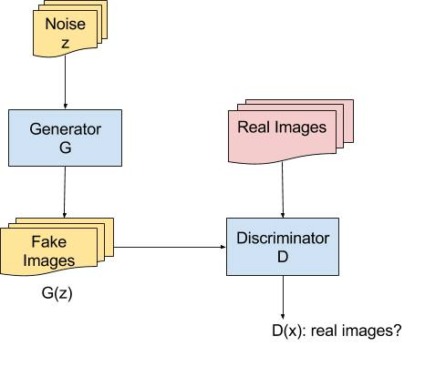

The [gan.py](gan.py) implements a basic, simple version of Generative Adversarial Network (**GAN**) with **discriminator** & **generator**. The architecture is shown as below,

In contrast to **DCGAN**, the architecture is a little simpler. However, it's a great step to start learning generative adversarial learning for beginners. And it's also convenient to transfer to DCGAN by adding **batch_normalization**, **ReLu** operations.

Inside the gan.py, the *function* of **main** pretrains a discriminator and trains discriminator & generator simultaneously while discriminator & generator 
are defined in *functions* of **discriminator** & **generator** respectively. For the ease of free computation, *function* of **load_generate** is defined to load the pretrained model on MNIST images and generate fake MNIST images as real as possible.

To illustrate convolution & deconvolution in the program clearly, the images are shown as below,

 
<i>Figure 2</i>, convolution.  
 
<i>Figure 3</i>, deconvolution.  

