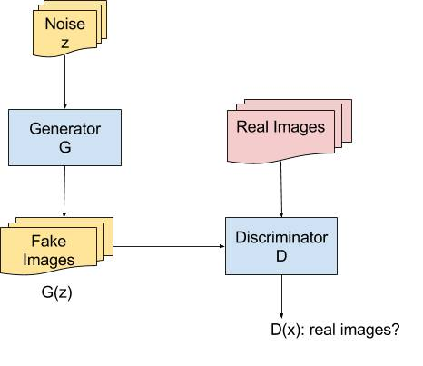

# generative_adversarial_networks
Generative Adversarial Network (GAN) &amp; its variants based on Tensorflow

Promisingly, it's going to be a zoo of GAN and its variants. More staightforward applications and resources of GANs will be added to empower the theory and experiments in terms of adversarial learning.

For beginners of adversarial learning and GAN, see [GAN_tutorial.pptx](GAN_tutorial.pptx) for a brief and quick look through the history, theory, architecture and applictions of GANs. The architecture of original GAN is shown as below,

Here is a list of papers (see more in [papers](papers)):
* [Original GAN](papers/GAN.pdf)
* [Techniques for GAN](papers/Improved_Techniques_for_Training_GANs.pdf)
* [WGAN](papers/Wasserstein_GAN.pdf)
* [Conditional GAN](papers/conditional_GAN.pdf)
* [Cycle GAN](papers/cycle_GAN.pdf)
* [Disco GAN](papers/Disco_GAN.pdf)
* [EBGAN](papers/EBGAN.pdf)
* [SRGAN](papers/Photo-Realistic_Single_Image_Super-Resolution_Using_a_Generative_Adversarial_Network.pdf)

